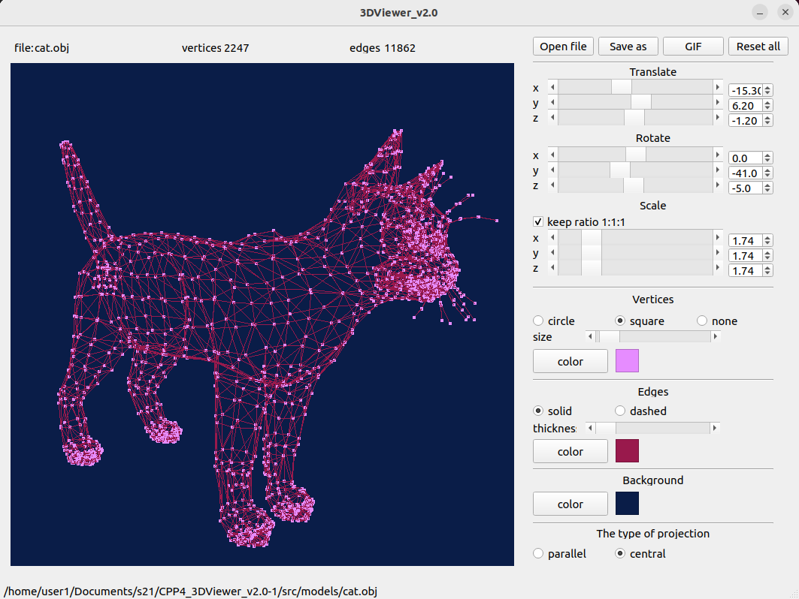
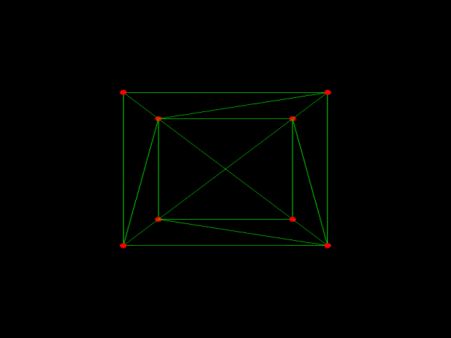

# 3DViewer v2.0

## Introduction

В данном проекте на языке программирования С++ в парадигме объектно-ориентированного  программирования реализовано приложение для просмотра 3D моделей в каркасном виде.  
Сами модели необходимо загружать из файлов формата .obj. В проекте реализована возможность  просматривать модели на экране вращая, масштабируя и перемещая объекты.  

### Демонстрация интерфейса программы
> Загруженная модель cat.obj

  
### Демонстрация окна отбражения
> Загруженная модель cube.obj

## Chapter I

### Part 1. 3DViewer v2.0

Разработать программу для визуализации каркасной модели в трехмерном пространстве.

- Программа должна быть разработана на языке C++ стандарта C++17;
- Код программы должен находиться в папке src;
- При написании кода необходимо придерживаться Google Style;
- Сборка программы должна быть настроена с помощью Makefile со стандартным набором целей для GNU-программ: all, install, uninstall, clean, dvi, dist, tests. Установка должна вестись в любой другой произвольный каталог;
- Программа должна быть разработана в соответствии с принципами объектно-ориентированного программирования, структурный подход запрещен;
- Должно быть обеспечено полное покрытие unit-тестами модулей, связанных с загрузкой моделей и аффинными преобразованиями;
- В один момент времени должна быть только одна модель на экране;
- Программа должна предоставлять возможность:
    - Загружать каркасную модель из файла формата obj (поддержка только списка вершин и поверхностей);
    - Перемещать модель на заданное расстояние относительно осей X, Y, Z;
    - Поворачивать модель на заданный угол относительно своих осей X, Y, Z;
    - Масштабировать модель на заданное значение;
- В программе должен быть реализован графический пользовательский интерфейс, на базе любой GUI-библиотеки с API для C++:
  * Для Linux: GTK+, CEF, Qt, JUCE;
  * Для Mac: GTK+, CEF, Qt, JUCE, SFML, Nanogui, Nngui;
- Графический пользовательский интерфейс должен содержать:
    - Кнопку для выбора файла с моделью и поле для вывода его названия;
    - Зону визуализации каркасной модели;
    - Кнопку/кнопки и поля ввода для перемещения модели;
    - Кнопку/кнопки и поля ввода для поворота модели;
    - Кнопку/кнопки и поля ввода для масштабирования модели; 
    - Информацию о загруженной модели - название файла, кол-во вершин и ребер;
- Программа должна корректно обрабатывать и позволять пользователю просматривать модели с деталями до 100, 1000, 10 000, 100 000, 1 000 000 вершин без зависания (зависание - это бездействие интерфейса более 0,5 секунды);
- Программа должна быть реализована с использованием паттерна MVC, то есть:
    - не должно быть кода бизнес-логики в коде представлений;
    - не должно быть кода интерфейса в контроллере и в модели;
    - контроллеры должны быть тонкими;
- Необходимо использовать минимум три различных паттерна проектирования (например, фасад, стратегия и команда);
- Классы должны быть реализованы внутри пространства имен `s21`;

### Part 2. Дополнительно. Настройки

- Программа должна позволять настраивать тип проекции (параллельная и центральная);
- Программа должна позволять настраивать тип (сплошная, пунктирная), цвет и толщину ребер, способ отображения (отсутствует, круг, квадрат), цвет и размер вершин;
- Программа должна позволять выбирать цвет фона;
- Настройки должны сохраняться между перезапусками программы.

### Part 3. Дополнительно. Запись
 
- Программа должна позволять сохранять полученные («отрендеренные») изображения в файл в форматах bmp и jpeg;
- Программа должна позволять по специальной кнопке записывать небольшие «скринкасты» - текущие пользовательские аффинные преобразования загруженного объекта в gif-анимацию (640x480, 10fps, 5s).
